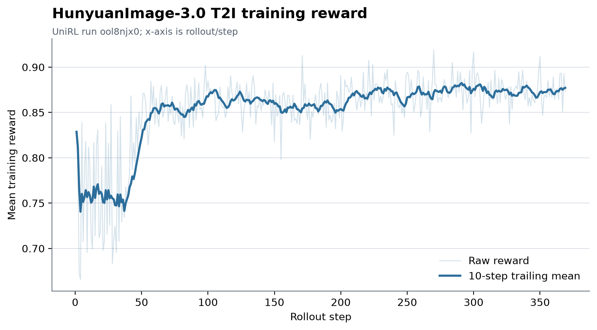

# HunyuanImage-3.0 UniRL reproduction

This directory records the UniRL trainside text-to-image reproduction using
HunyuanImage-3.0-Instruct.

## Recipe

- Source: [Tencent-Hunyuan/UniRL at `947632d`](https://github.com/Tencent-Hunyuan/UniRL/commit/947632d12b649d34da04e3f29433adb2c05e0e30)
- W&B run: [`ool8njx0`](https://wandb.ai/leviking98z-zhejiang-university/hi3-grpo/runs/ool8njx0)
- Hardware: 8 NVIDIA H20 GPUs
- Work unit: 16 prompts × 4 samples = 64 images per rollout
- Sampling: 1024 × 1024, 16 inference steps, 3 SDE steps
- Objective: FlowGRPO with PickScore reward
- Seed: 42

The exact Hydra recipe used by this run is preserved in [`recipe.yaml`](recipe.yaml).
The run logged 369 rollouts; its configured maximum was 500.

## Training curve

The mean reward averaged over the first 10 rollouts was **0.762** and over the
last 10 recorded rollouts was **0.877**. The light line shows every recorded
reward and the dark line is a 10-step trailing mean.

[`curve.csv`](curve.csv) contains the exported W&B history. Its x-axis is
`rollout/step`, not W&B's default `_step`.
