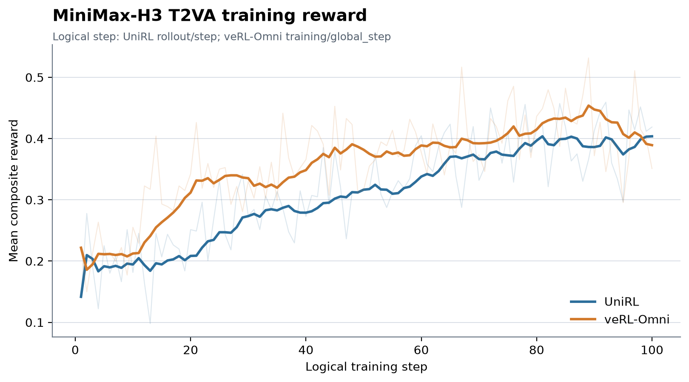
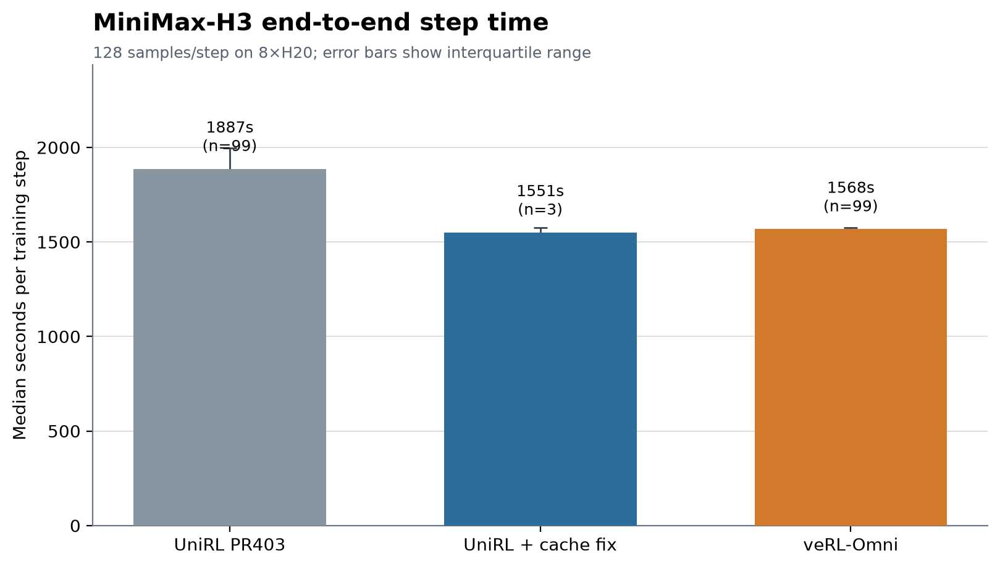

# MiniMax-H3 UniRL reproduction and veRL-Omni comparison

This directory records the MiniMax-H3 text-to-video-with-audio reproduction in
UniRL and a configuration-matched veRL-Omni control.

## Recipes

- UniRL source: [PR403 commit `d8e4aefa`](https://github.com/Tencent-Hunyuan/UniRL/commit/d8e4aefa7a266b229e05a82f7ac17bbac537e639)
- UniRL run: [`x8b0x8al`](https://wandb.ai/leviking98z-zhejiang-university/unirl-minimax-h3-t2va/runs/x8b0x8al)
- veRL-Omni run: [`646mvxxs`](https://wandb.ai/leviking98z-zhejiang-university/unirl-minimax-h3-t2va/runs/646mvxxs)
- Cache-fix check: [`munhe02k`](https://wandb.ai/leviking98z-zhejiang-university/unirl-minimax-h3-t2va/runs/munhe02k)
- Hardware: one node with 8 NVIDIA H20 GPUs per run
- Work unit: 8 prompts × 16 samples = 128 trajectories per step
- Sampling: 256 × 384, 124 frames, 10 denoising/SDE transitions
- Objective: FlowGRPO, one optimizer update, learning rate 1e-4
- Reward: ImageBind audio-video + CLAP text-audio
- Seed: 42

The actual configurations are preserved as [`unirl_recipe.yaml`](unirl_recipe.yaml)
and [`verl_omni_recipe.sh`](verl_omni_recipe.sh). The veRL-Omni recipe explicitly
matches the prompt batch, group size, canvas, frame count, SDE transitions,
optimizer, LoRA targets, reward functions, and seed.

## Training curve

Both runs learn under the matched recipe. The figure fixes both curves to their
first 100 logical steps. UniRL's mean reward averaged over the first/last 10
steps was **0.194 / 0.404**; veRL-Omni's was **0.212 / 0.389**.

[`curve.csv`](curve.csv) uses each framework's logical step: UniRL
`rollout/step` and veRL-Omni `training/global_step`. W&B's default `_step` is
not comparable because one UniRL logical step produces multiple W&B records.

## Performance

[`performance.csv`](performance.csv) reports medians and interquartile ranges.
The long-run comparison uses the same logical steps 2–100, excluding step 1 as
warm-up. PR403 UniRL measured **1887 s/step**, versus **1568 s/step** for
veRL-Omni. The cache-only check measured **1551 s/step** over steps 2–4: an
18.0% reduction from PR403 and within 1.1% of the veRL-Omni long-run median.

The PR403 gap is concentrated in rollout generation. Its frozen 32B Qwen3-VL
conditioner is recomputed for every sibling sample when
`forward_batch_size=1`. [PR410](https://github.com/Tencent-Hunyuan/UniRL/pull/410)
introduced a CPU prompt-embedding cache; the
exact [`conditioning_cache.patch`](conditioning_cache.patch) used here is a
cache-only backport of that fix. Its generation median fell from **745 s** in
the PR403 long run to **405 s**, while its training median remained **1104 s**.
The check contains only three post-warm-up measurements, so it validates the
regression fix rather than serving as a long-run variance estimate.

End-to-end step time is the primary comparison. Framework-native phase timers
have different boundaries, so they are retained in the CSV but are not stacked
as if they were identical.
